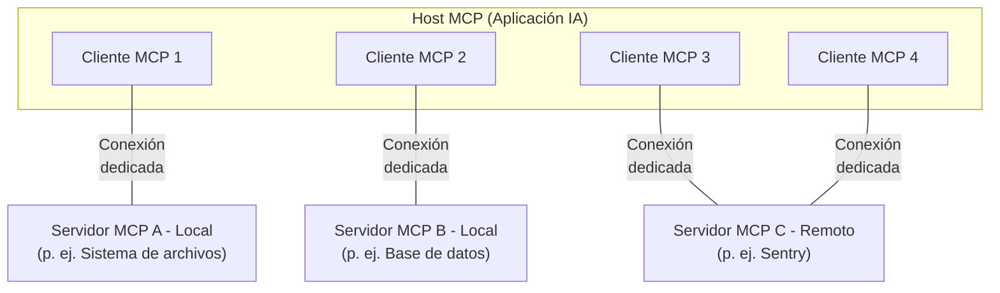

Obtenido de [modelcontexprotocol.io](https://modelcontextprotocol.io/docs/learn/architecture)

# Visión general de la arquitectura

Esta visión general del Model Context Protocol (MCP) describe su [alcance](#alcance) y sus [conceptos de MCP](#conceptos-de-mcp), y ofrece un [ejemplo](#ejemplo) que demuestra cada concepto clave.

Dado que los SDKs de MCP abstraen muchas complejidades, la mayoría de los desarrolladores probablemente encontrarán la sección del [protocolo de la capa de datos](#protocolo-de-la-capa-de-datos) como la más útil. Allí se explica cómo los servidores MCP pueden proporcionar contexto a una aplicación de IA.

Para detalles de implementación específicos, consulta la documentación del [SDK para tu lenguaje](https://modelcontextprotocol.io/docs/sdk).

## Alcance

El Model Context Protocol incluye los siguientes proyectos:

* [Especificación MCP](https://modelcontextprotocol.io/specification/latest): Especificación del MCP que describe los requisitos de implementación para clientes y servidores.
* [SDKs de MCP](https://modelcontextprotocol.io/docs/sdk): SDKs para distintos lenguajes que implementan MCP.
* **Herramientas de desarrollo MCP**: Utilidades para desarrollar servidores y clientes MCP, incluido el [MCP Inspector](https://github.com/modelcontextprotocol/inspector).
* [Implementaciones de referencia de servidores MCP](https://github.com/modelcontextprotocol/servers): Implementaciones de referencia de servidores MCP.

<Note>
  MCP se centra únicamente en el protocolo de intercambio de contexto — no dicta
  cómo las aplicaciones de IA usan los LLMs ni cómo gestionan el contexto proporcionado.
</Note>

## Conceptos de MCP

### Participantes

MCP sigue una arquitectura cliente‑servidor en la que un host MCP —una aplicación de IA como [Claude Code](https://www.anthropic.com/claude-code) o [Claude Desktop](https://www.claude.ai/download)— establece conexiones con uno o más servidores MCP. El host MCP crea un cliente MCP por cada servidor MCP y cada cliente mantiene una conexión dedicada con su servidor correspondiente.

Los servidores MCP locales que usan el transporte STDIO suelen atender a un solo cliente MCP, mientras que los servidores MCP remotos que usan el transporte Streamable HTTP normalmente atienden a múltiples clientes.

Los participantes clave en la arquitectura MCP son:

* **MCP Host**: La aplicación de IA que coordina y gestiona uno o varios clientes MCP
* **MCP Client**: Un componente que mantiene la conexión con un servidor MCP y obtiene contexto para que el host MCP lo utilice
* **MCP Server**: Un programa que proporciona contexto a los clientes MCP

**Por ejemplo**: Visual Studio Code actúa como host MCP. Cuando Visual Studio Code establece una conexión con un servidor MCP, como el [servidor Sentry MCP](https://docs.sentry.io/product/sentry-mcp/), el runtime de Visual Studio Code instancia un objeto cliente MCP que mantiene la conexión con el servidor Sentry.
Cuando Visual Studio Code se conecta posteriormente a otro servidor MCP, por ejemplo al [servidor de sistema de archivos local](https://github.com/modelcontextprotocol/servers/tree/main/src/filesystem), el runtime crea un cliente MCP adicional para mantener esa conexión.



Tenga en cuenta que **servidor MCP** se refiere al programa que sirve los datos de contexto, independientemente de dónde se ejecute. Los servidores MCP pueden ejecutarse de forma local o remota. Por ejemplo, cuando Claude Desktop lanza el [servidor de sistema de archivos](https://github.com/modelcontextprotocol/servers/tree/main/src/filesystem), el servidor se ejecuta localmente en la misma máquina porque utiliza el transporte STDIO. A esto se le suele llamar "servidor MCP local". El servidor oficial de [Sentry MCP](https://docs.sentry.io/product/sentry-mcp/) se ejecuta en la plataforma Sentry y utiliza el transporte Streamable HTTP; a esto se le suele llamar "servidor MCP remoto".

### Capas

MCP consta de dos capas:

* **Capa de datos**: Define el protocolo (basado en JSON‑RPC) para la comunicación cliente‑servidor, incluyendo la gestión del ciclo de vida y primitivos centrales como herramientas, recursos, prompts y notificaciones.
* **Capa de transporte**: Define los mecanismos y canales de comunicación que permiten el intercambio de datos entre clientes y servidores, incluyendo el establecimiento de conexiones específicas del transporte, el enmarcado de mensajes y la autorización.

Conceptualmente, la capa de datos es la capa interior, mientras que la capa de transporte es la capa exterior.

#### Capa de datos

La capa de datos implementa un protocolo de intercambio basado en [JSON‑RPC 2.0](https://www.jsonrpc.org/) que define la estructura y la semántica de los mensajes.
Esta capa incluye:

* **Gestión del ciclo de vida**: Maneja la inicialización de la conexión, la negociación de capacidades y la terminación entre clientes y servidores
* **Características del servidor**: Permite a los servidores ofrecer funcionalidad principal, incluyendo herramientas para acciones de IA, recursos para datos de contexto y prompts como plantillas de interacción
* **Características del cliente**: Permite a los servidores pedir al cliente que muestree del LLM del host, solicite entrada al usuario y registre mensajes en el cliente
* **Características utilitarias**: Soporta capacidades adicionales como notificaciones para actualizaciones en tiempo real y seguimiento de progreso en operaciones de larga duración

#### Capa de transporte

La capa de transporte gestiona los canales de comunicación y la autenticación entre clientes y servidores. Se encarga del establecimiento de la conexión, el enmarcado de mensajes y la comunicación segura entre los participantes MCP.

MCP admite dos mecanismos de transporte:

* **Transporte STDIO**: Usa los flujos estándar de entrada/salida para la comunicación directa entre procesos locales en la misma máquina, ofreciendo un rendimiento óptimo sin sobrecarga de red.
* **Transporte Streamable HTTP**: Usa HTTP POST para mensajes cliente→servidor con Server‑Sent Events opcionales para capacidades de streaming. Este transporte permite comunicación con servidores remotos y admite métodos estándar de autenticación HTTP, incluidos tokens bearer, claves API y encabezados personalizados. MCP recomienda usar OAuth para obtener tokens de autenticación.

La capa de transporte abstrae los detalles de comunicación de la capa de protocolo, permitiendo el mismo formato de mensaje JSON‑RPC 2.0 en todos los mecanismos de transporte.

### Protocolo de la capa de datos

Una parte central de MCP es definir el esquema y la semántica entre clientes MCP y servidores MCP. Los desarrolladores probablemente encontrarán la capa de datos —en particular, el conjunto de [primitivos](#primitives)— como la parte más interesante de MCP. Es la porción del protocolo que define las maneras en que los desarrolladores pueden compartir contexto desde servidores MCP hacia clientes MCP.

MCP utiliza [JSON‑RPC 2.0](https://www.jsonrpc.org/) como su protocolo RPC subyacente. Clientes y servidores intercambian solicitudes y respuestas entre sí. Se pueden usar notificaciones cuando no se requiere respuesta.

#### Gestión del ciclo de vida

MCP es un <Tooltip tip="A subset of MCP can be made stateless using the Streamable HTTP transport">protocolo con estado</Tooltip> que requiere gestión del ciclo de vida. El propósito de esta gestión es negociar las <Tooltip tip="Features and operations that a client or server supports, such as tools, resources, or prompts">capacidades</Tooltip> que tanto el cliente como el servidor soportan. Información detallada está disponible en la [especificación](/specification/latest/basic/lifecycle), y el [ejemplo](#example) muestra la secuencia de inicialización.

#### Primitivos

Los primitivos de MCP son el concepto más importante dentro del protocolo. Definen qué pueden ofrecerse mutuamente clientes y servidores. Estos primitivos especifican los tipos de información contextual que pueden compartirse con aplicaciones de IA y el conjunto de acciones que pueden ejecutarse.

MCP define tres primitivos principales que los *servidores* pueden exponer:

* **Tools**: Funciones ejecutables que las aplicaciones de IA pueden invocar para realizar acciones (p. ej., operaciones de archivos, llamadas a APIs, consultas a bases de datos)
* **Resources**: Fuentes de datos que proporcionan información contextual a las aplicaciones de IA (p. ej., contenido de archivos, registros de bases de datos, respuestas de APIs)
* **Prompts**: Plantillas reutilizables que ayudan a estructurar las interacciones con modelos de lenguaje (p. ej., prompts del sistema, ejemplos few‑shot)

Cada tipo de primitivo tiene métodos asociados para descubrimiento (`*/list`), recuperación (`*/get`) y, en algunos casos, ejecución (`tools/call`).
Los clientes MCP usarán los métodos `*/list` para descubrir los primitivos disponibles. Por ejemplo, un cliente puede listar primero todas las herramientas disponibles (`tools/list`) y luego ejecutarlas. Este diseño permite que los listados sean dinámicos.

Como ejemplo concreto, considera un servidor MCP que proporciona contexto sobre una base de datos. Puede exponer herramientas para consultar la base de datos, un recurso que contiene el esquema de la base de datos y un prompt que incluya ejemplos few‑shot para interactuar con las herramientas.

Para más detalles sobre los primitivos de servidor consulta [server concepts](./server-concepts).

MCP también define primitivos que los *clientes* pueden exponer. Estos primitivos permiten a los autores de servidores MCP crear interacciones más ricas.

* **Sampling**: Permite a los servidores solicitar completaciones del modelo de lenguaje desde la aplicación de IA del cliente. Esto es útil cuando los autores del servidor desean acceso a un modelo de lenguaje pero quieren mantenerse independientes del modelo y no incluir un SDK de modelo en su servidor MCP. Pueden usar el método `sampling/complete` para solicitar una completación.
* **Elicitation**: Permite a los servidores solicitar información adicional a los usuarios. Es útil cuando los autores necesitan más datos del usuario o una confirmación de una acción. Pueden usar `elicitation/request` para solicitar esa información.
* **Logging**: Permite a los servidores enviar mensajes de registro al cliente con fines de depuración y monitorización.

Para más detalles sobre los primitivos de cliente consulta [client concepts](./client-concepts).

Además de los primitivos de servidor y cliente, el protocolo ofrece primitivos utilitarios transversales que amplían cómo se ejecutan las solicitudes:

* **Tasks (Experimental)**: Wrappers de ejecución duraderos que permiten la recuperación diferida de resultados y el seguimiento del estado para solicitudes MCP (p. ej., cálculos costosos, automatización de flujos de trabajo, procesamiento por lotes, operaciones en múltiples pasos)

#### Notificaciones

El protocolo admite notificaciones en tiempo real para habilitar actualizaciones dinámicas entre servidores y clientes. Por ejemplo, cuando cambian las herramientas disponibles en un servidor —por ejemplo, cuando hay nueva funcionalidad o se modifican herramientas existentes— el servidor puede enviar notificaciones de actualización de herramientas para informar a los clientes conectados sobre esos cambios. Las notificaciones se envían como mensajes de notificación JSON‑RPC 2.0 (sin esperar respuesta) y permiten que los servidores MCP proporcionen actualizaciones en tiempo real a los clientes conectados.

## Ejemplo

### Capa de datos

Esta sección ofrece un recorrido paso a paso de una interacción cliente‑servidor MCP, centrada en el protocolo de la capa de datos. Demostraremos la secuencia de ciclo de vida, las operaciones con herramientas y las notificaciones usando mensajes JSON‑RPC 2.0.

<Steps>
  <Step title="Inicialización (Gestión del ciclo de vida)">
    MCP comienza con la gestión del ciclo de vida mediante un intercambio de negociación de capacidades. Como se describe en la sección de [gestión del ciclo de vida](#lifecycle-management), el cliente envía una solicitud `initialize` para establecer la conexión y negociar las funciones soportadas.

    <CodeGroup>
      ```json Initialize Request theme={null}
      {
        "jsonrpc": "2.0",
        "id": 1,
        "method": "initialize",
        "params": {
          "protocolVersion": "2025-06-18",
          "capabilities": {
            "elicitation": {}
          },
          "clientInfo": {
            "name": "example-client",
            "version": "1.0.0"
          }
        }
      }
      ```

      ```json Initialize Response theme={null}
      {
        "jsonrpc": "2.0",
        "id": 1,
        "result": {
          "protocolVersion": "2025-06-18",
          "capabilities": {
            "tools": {
              "listChanged": true
            },
            "resources": {}
          },
          "serverInfo": {
            "name": "example-server",
            "version": "1.0.0"
          }
        }
      }
      ```
    </CodeGroup>

    #### Entendiendo el intercambio de inicialización

    El proceso de inicialización es una parte clave de la gestión del ciclo de vida de MCP y cumple varios propósitos críticos:

    1. **Negociación de versión del protocolo**: El campo `protocolVersion` (p. ej., "2025-06-18") garantiza que tanto el cliente como el servidor usen versiones del protocolo compatibles. Esto evita errores de comunicación que podrían ocurrir si versiones incompatibles intentan interactuar. Si no se negocia una versión mutuamente compatible, la conexión debe cerrarse.

    2. **Descubrimiento de capacidades**: El objeto `capabilities` permite a cada parte declarar las funciones que soporta, incluyendo qué [primitivos](#primitives) puede manejar (tools, resources, prompts) y si soporta características como [notificaciones](#notifications). Esto permite una comunicación eficiente al evitar operaciones no soportadas.

    3. **Intercambio de identidad**: Los objetos `clientInfo` y `serverInfo` proporcionan información de identificación y versionado para depuración y compatibilidad.

    En este ejemplo, la negociación de capacidades demuestra cómo se declaran los primitivos MCP:

    **Capacidades del cliente**:

    * `"elicitation": {}` - El cliente declara que puede manejar solicitudes de interacción con el usuario (puede recibir llamadas al método `elicitation/create`)

    **Capacidades del servidor**:

    * `"tools": {"listChanged": true}` - El servidor soporta el primitivo de herramientas Y puede enviar notificaciones `tools/list_changed` cuando su lista de herramientas cambie
    * `"resources": {}` - El servidor también soporta el primitivo de recursos (puede manejar `resources/list` y `resources/read`)

    Tras una inicialización exitosa, el cliente envía una notificación para indicar que está listo:

    ```json Notification theme={null}
    {
      "jsonrpc": "2.0",
      "method": "notifications/initialized"
    }
    ```

    #### Cómo funciona esto en aplicaciones de IA

    Durante la inicialización, el gestor de clientes MCP de la aplicación de IA establece conexiones con los servidores configurados y almacena sus capacidades para uso posterior. La aplicación usa esta información para determinar qué servidores pueden proporcionar tipos específicos de funcionalidad (tools, resources, prompts) y si admiten actualizaciones en tiempo real.

    ```python Pseudo-code for AI application initialization theme={null}
    # Pseudo Code
    async with stdio_client(server_config) as (read, write):
        async with ClientSession(read, write) as session:
            init_response = await session.initialize()
            if init_response.capabilities.tools:
                app.register_mcp_server(session, supports_tools=True)
            app.set_server_ready(session)
    ```
  </Step>

  <Step title="Descubrimiento de herramientas (Primitivos)">
    Una vez establecida la conexión, el cliente puede descubrir las herramientas disponibles enviando una solicitud `tools/list`. Esta solicitud es fundamental para el mecanismo de descubrimiento de herramientas de MCP: permite a los clientes entender qué herramientas ofrece el servidor antes de intentar usarlas.

    <CodeGroup>
      ```json Tools List Request theme={null}
      {
        "jsonrpc": "2.0",
        "id": 2,
        "method": "tools/list"
      }
      ```

      ```json Tools List Response theme={null}
      {
        "jsonrpc": "2.0",
        "id": 2,
        "result": {
          "tools": [
            {
              "name": "calculator_arithmetic",
              "title": "Calculator",
              "description": "Perform mathematical calculations including basic arithmetic, trigonometric functions, and algebraic operations",
              "inputSchema": {
                "type": "object",
                "properties": {
                  "expression": {
                    "type": "string",
                    "description": "Mathematical expression to evaluate (e.g., '2 + 3 * 4', 'sin(30)', 'sqrt(16)')"
                  }
                },
                "required": ["expression"]
              }
            },
            {
              "name": "weather_current",
              "title": "Weather Information",
              "description": "Get current weather information for any location worldwide",
              "inputSchema": {
                "type": "object",
                "properties": {
                  "location": {
                    "type": "string",
                    "description": "City name, address, or coordinates (latitude,longitude)"
                  },
                  "units": {
                    "type": "string",
                    "enum": ["metric", "imperial", "kelvin"],
                    "description": "Temperature units to use in response",
                    "default": "metric"
                  }
                },
                "required": ["location"]
              }
            }
          ]
        }
      }
      ```
    </CodeGroup>

    #### Entendiendo la solicitud de descubrimiento de herramientas

    La solicitud `tools/list` es simple y no contiene parámetros.

    #### Entendiendo la respuesta de descubrimiento de herramientas

    La respuesta contiene un arreglo `tools` que ofrece metadatos completos sobre cada herramienta disponible. Esta estructura basada en arreglos permite que los servidores expongan múltiples herramientas simultáneamente manteniendo límites claros entre funcionalidades.

    Cada objeto de herramienta en la respuesta incluye varios campos clave:

    * **`name`**: Un identificador único para la herramienta dentro del espacio de nombres del servidor. Sirve como clave primaria para la ejecución de la herramienta y debería seguir un patrón de nombres claro (p. ej., `calculator_arithmetic` en lugar de solo `calculate`)
    * **`title`**: Un nombre legible por humanos que los clientes pueden mostrar a los usuarios
    * **`description`**: Explicación detallada de lo que hace la herramienta y cuándo usarla
    * **`inputSchema`**: Un JSON Schema que define los parámetros de entrada esperados, permitiendo validación de tipos y proporcionando documentación clara sobre parámetros requeridos y opcionales

    #### Cómo funciona esto en aplicaciones de IA

    La aplicación de IA recupera las herramientas disponibles de todos los servidores MCP conectados y las combina en un registro unificado de herramientas que el modelo de lenguaje puede consultar. Esto permite al LLM entender qué acciones puede ejecutar y generar automáticamente las llamadas a herramientas apropiadas durante las conversaciones.

    ```python Pseudo-code for AI application tool discovery theme={null}
    # Pseudo-code using MCP Python SDK patterns
    available_tools = []
    for session in app.mcp_server_sessions():
        tools_response = await session.list_tools()
        available_tools.extend(tools_response.tools)
    conversation.register_available_tools(available_tools)
    ```
  </Step>

  <Step title="Ejecución de herramientas (Primitivos)">
    El cliente ahora puede ejecutar una herramienta usando el método `tools/call`. Esto muestra cómo se utilizan los primitivos MCP en la práctica: después de descubrir las herramientas, el cliente puede invocarlas con los argumentos adecuados.

    #### Entendiendo la solicitud de ejecución de herramienta

    La solicitud `tools/call` sigue un formato estructurado que asegura seguridad de tipos y comunicación clara entre cliente y servidor. Observa que usamos el nombre exacto de la herramienta desde la respuesta de descubrimiento (`weather_current`) en lugar de un nombre simplificado:

    <CodeGroup>
      ```json Tool Call Request theme={null}
      {
        "jsonrpc": "2.0",
        "id": 3,
        "method": "tools/call",
        "params": {
          "name": "weather_current",
          "arguments": {
            "location": "San Francisco",
            "units": "imperial"
          }
        }
      }
      ```

      ```json Tool Call Response theme={null}
      {
        "jsonrpc": "2.0",
        "id": 3,
        "result": {
          "content": [
            {
              "type": "text",
              "text": "Current weather in San Francisco: 68°F, partly cloudy with light winds from the west at 8 mph. Humidity: 65%"
            }
          ]
        }
      }
      ```
    </CodeGroup>

    #### Elementos clave de la ejecución de herramienta

    La estructura de la solicitud incluye varios componentes importantes:

    1. **`name`**: Debe coincidir exactamente con el nombre de la herramienta de la respuesta de descubrimiento (`weather_current`). Esto asegura que el servidor pueda identificar correctamente qué herramienta ejecutar.

    2. **`arguments`**: Contiene los parámetros de entrada según lo definido por el `inputSchema` de la herramienta. En este ejemplo:
       * `location`: "San Francisco" (parámetro requerido)
       * `units`: "imperial" (parámetro opcional, por defecto `metric` si no se especifica)

    3. **Estructura JSON‑RPC**: Usa el formato estándar JSON‑RPC 2.0 con un `id` único para correlacionar solicitud y respuesta.

    #### Entendiendo la respuesta de ejecución de herramienta

    La respuesta demuestra el sistema de contenido flexible de MCP:

    1. **Arreglo `content`**: Las respuestas de las herramientas devuelven un arreglo de objetos de contenido, lo que permite respuestas ricas y en múltiples formatos (texto, imágenes, recursos, etc.)

    2. **Tipos de contenido**: Cada objeto de contenido tiene un campo `type`. En este ejemplo, `"type": "text"` indica contenido en texto plano, pero MCP admite varios tipos de contenido según el caso de uso.

    3. **Salida estructurada**: La respuesta proporciona información accionable que la aplicación de IA puede usar como contexto para las interacciones con el modelo de lenguaje.

    Este patrón de ejecución permite a las aplicaciones de IA invocar dinámicamente la funcionalidad del servidor y recibir respuestas estructuradas que pueden integrarse en las conversaciones con los modelos de lenguaje.

    #### Cómo funciona esto en aplicaciones de IA

    Cuando el modelo de lenguaje decide usar una herramienta durante una conversación, la aplicación de IA intercepta la llamada a la herramienta, la enruta al servidor MCP correspondiente, la ejecuta y devuelve los resultados al LLM como parte del flujo de la conversación. Esto permite al LLM acceder a datos en tiempo real y realizar acciones en el mundo externo.

    ```python  theme={null}
    # Pseudo-code for AI application tool execution
    async def handle_tool_call(conversation, tool_name, arguments):
        session = app.find_mcp_session_for_tool(tool_name)
        result = await session.call_tool(tool_name, arguments)
        conversation.add_tool_result(result.content)
    ```
  </Step>

  <Step title="Actualizaciones en tiempo real (Notificaciones)">
    MCP soporta notificaciones en tiempo real que permiten a los servidores informar a los clientes sobre cambios sin que estos lo soliciten explícitamente. Esto demuestra el sistema de notificaciones, una característica clave que mantiene las conexiones MCP sincronizadas y receptivas.

    #### Entendiendo las notificaciones de cambio en la lista de herramientas

    Cuando cambian las herramientas disponibles en el servidor —por ejemplo, cuando hay nueva funcionalidad disponible, se modifican herramientas existentes o algunas herramientas dejan de estar disponibles temporalmente— el servidor puede notificar proactivamente a los clientes conectados:

    ```json Request theme={null}
    {
      "jsonrpc": "2.0",
      "method": "notifications/tools/list_changed"
    }
    ```

    #### Características clave de las notificaciones MCP

    1. **No se requiere respuesta**: Observa que no hay un campo `id` en la notificación. Esto sigue la semántica de notificaciones de JSON‑RPC 2.0, donde no se espera ni se envía respuesta.

    2. **Basadas en capacidades**: Esta notificación solo la envían servidores que declararon `"listChanged": true` en su capability de tools durante la inicialización (como se mostró en el Paso 1).

    3. **Impulsadas por eventos**: El servidor decide cuándo enviar notificaciones según cambios en su estado interno, lo que hace a las conexiones MCP dinámicas y receptivas.

    #### Respuesta del cliente a las notificaciones

    Al recibir esta notificación, el cliente normalmente reacciona solicitando la lista de herramientas actualizada. Esto crea un ciclo de actualización que mantiene la visión del cliente sobre las herramientas disponible al día:

    ```json Request theme={null}
    {
      "jsonrpc": "2.0",
      "id": 4,
      "method": "tools/list"
    }
    ```

    #### Por qué importan las notificaciones

    Este sistema de notificaciones es crucial por varias razones:

    1. **Entornos dinámicos**: Las herramientas pueden aparecer o desaparecer según el estado del servidor, dependencias externas o permisos de usuario
    2. **Eficiencia**: Los clientes no necesitan hacer polling para detectar cambios; son notificados cuando ocurren actualizaciones
    3. **Consistencia**: Asegura que los clientes siempre tengan información precisa sobre las capacidades del servidor
    4. **Colaboración en tiempo real**: Permite aplicaciones de IA receptivas que se adaptan a contextos cambiantes

    Este patrón de notificaciones se extiende más allá de las herramientas a otros primitivos MCP, permitiendo una sincronización en tiempo real completa entre clientes y servidores.

    #### Cómo funciona esto en aplicaciones de IA

    Cuando la aplicación de IA recibe una notificación sobre herramientas cambiadas, refresca inmediatamente su registro de herramientas y actualiza las capacidades disponibles para el LLM. Esto garantiza que las conversaciones en curso siempre tengan acceso al conjunto más reciente de herramientas y que el LLM pueda adaptarse dinámicamente a nuevas funcionalidades cuando estén disponibles.

    ```python  theme={null}
    # Pseudo-code for AI application notification handling
    async def handle_tools_changed_notification(session):
        tools_response = await session.list_tools()
        app.update_available_tools(session, tools_response.tools)
        if app.conversation.is_active():
            app.conversation.notify_llm_of_new_capabilities()
    ```
  </Step>
</Steps>
